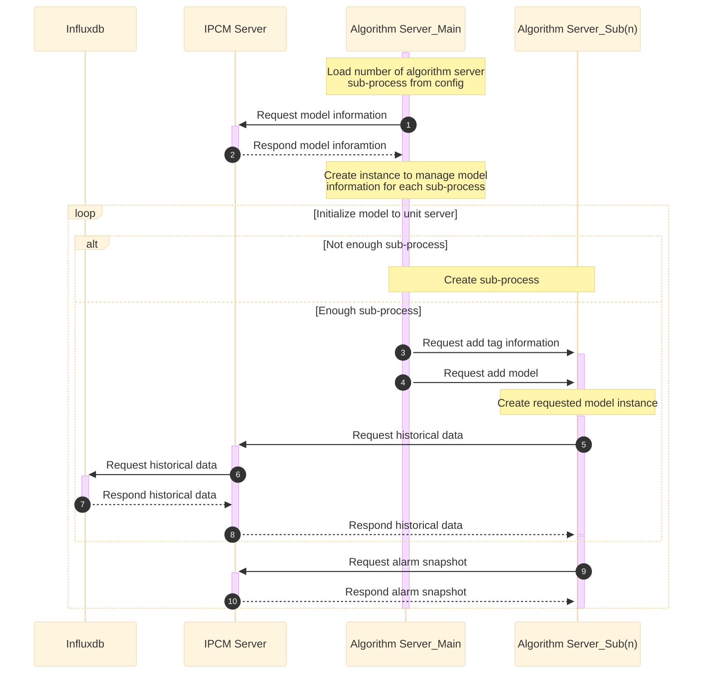

### ***Sequence Diagram***
----------------------------------------------------------------
### __Initializing Algorithm Server__

```mermaid
%%{init: {'securityLevel': 'loose', 'theme':'base'
 }}%%
sequenceDiagram
    autonumber
    participant Influx as Influxdb
    participant IPCM as IPCM Server
    participant A as Algorithm Server_Main
    participant A1 as Algorithm Server_Sub(n)

    activate A
    # Model Information
    Note over A: Load number of algorithm server<br>sub-process from config
    A ->>+ IPCM: Request model information
    IPCM -->>- A: Respond model inforamtion
    Note over A: Create instance to manage model<br>information for each sub-process

    activate A1
    loop Initialize model to unit server
        
        alt Not enough sub-process
            Note over A, A1: Create sub-process
        else Enough sub-process
            A ->>+ A1: Request add tag information
            A ->> A1: Request add model
            Note over A1: Create requested model instance

            deactivate A1


            activate A1
            A1->>+IPCM: Request historical data
            IPCM->>+Influx: Request historical data
            Influx-->>-IPCM: Respond historical data
            IPCM-->>-A1: Respond historical data
            deactivate A1

            activate A1
        end
        A1 ->>+ IPCM: Request alarm snapshot
        IPCM -->>- A1: Respond alarm snapshot

    end
    deactivate A1
    
    deactivate A


```